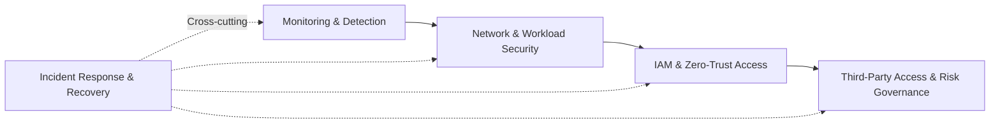

# Healthcare Security Architecture Investments

**Using Public Breach Evidence, NIST Guidance, and Financial Decision Analysis**

## Overview

Healthcare organizations make security investment decisions under uncertainty. Public breach data can reveal patterns in reported incidents, but those patterns do not directly determine which security capabilities should be prioritized or whether an investment will be financially justified.

This applied business analytics project uses U.S. Department of Health and Human Services Office for Civil Rights (HHS OCR) breach data to connect statistical evidence with security and financial decision-making.

The study asks three questions:

1. **What characteristics are associated with severe reported healthcare breaches?**
2. **How can those findings inform security capability priorities?**
3. **Under what financial conditions do security investments become economically supportable?**

## Analytical Approach

The project intentionally separates empirical analysis, security decision analysis, and financial analysis. Statistical associations are not interpreted as causal effects, and regression results are not treated as direct technology recommendations.

## Data Foundation

The final analytical sample contains **7,877 reported breaches**, including **801 severe breaches (10.2%)**. A severe breach is defined in this study as one affecting at least **100,000 individuals**.

The median breach affected approximately **4,000 individuals**, while the mean was approximately **136,399**, reflecting a strongly right-skewed distribution.

## Key Findings

Network-server involvement was associated with **3.49 times the adjusted odds** of a severe reported breach (95% CI: 2.84–4.30). Business Associate entity type was associated with **3.55 times the adjusted odds** relative to Healthcare Providers (95% CI: 2.70–4.66).

The logistic regression demonstrated moderate and stable discrimination, with a held-out **ROC-AUC of 0.776** and a five-fold cross-validation mean **ROC-AUC of 0.757 (SD = 0.012)**.

**Monitoring and Detection** ranked first under both equal-weight and risk-focused security capability evaluations.

None of the primary financial scenarios produced positive five-year NPV or finite payback. Sensitivity analysis showed that a **$100,000 initial investment with no annual operating cost required an 11.7% risk reduction to break even**.

## Decision Logic

| Analytical Layer | Decision Question |
|---|---|
| Breach analysis and regression | What characteristics are associated with severe outcomes? |
| Model validation | Are the model results reasonably stable? |
| Security capability evaluation | What capabilities deserve greater priority? |
| Financial analysis | Under what conditions does the investment make financial sense? |
| Roadmap | How can the priorities be sequenced? |

## Roadmap

The roadmap is a decision sequence rather than a universal implementation prescription. Investment scale and timing should be adapted to an organization's own exposure, implementation cost, operating requirements, and realistically achievable risk reduction.

## Scope and Limitations

HHS OCR records describe reported healthcare breaches and do not provide an organization-year denominator. The analysis therefore cannot estimate the annual probability that a particular healthcare organization will experience a breach.

The severe-breach threshold of 100,000 affected individuals is study-defined. The observational design supports association rather than causal inference. Financial results depend on scenario assumptions because the public data do not contain complete organization-specific investment costs, losses, or control-effectiveness estimates.

## Standards and Guidance

The security decision analysis is informed by **NIST Cybersecurity Framework 2.0**, **NIST SP 800-30**, **NIST SP 800-207**, and HHS OCR healthcare breach reporting data.
