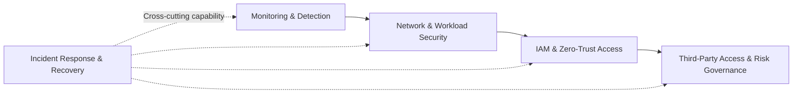

# Healthcare Security Architecture Investments

**Using Public Breach Evidence, NIST Guidance, and Financial Decision Analysis**

An applied business analytics project examining how public healthcare breach evidence can support more transparent security investment decisions. The project combines descriptive analytics, interpretable statistical modeling, model validation, security capability evaluation, and financial sensitivity analysis.

---

## Project Overview

Healthcare security decisions are often made under uncertainty. Public breach data can describe observed patterns, but it cannot by itself determine which technology an organization should purchase or whether an investment will generate a positive financial return.

This project separates those questions into three analytical layers:

| Layer | Question | Approach |
|---|---|---|
| **Empirical analysis** | What patterns are associated with severe reported breaches? | Descriptive statistics, association testing, logistic regression, validation |
| **Security decision analysis** | Which capabilities deserve greater consideration? | Evidence-to-capability mapping, NIST alignment, multi-criteria scoring, weighting sensitivity |
| **Financial decision analysis** | Under what conditions does an investment become economically supportable? | ALE, NPV, payback, break-even, scenario and sensitivity analysis |

---

## Analytical Workflow

The workflow is intentionally sequential, but the analytical components remain distinct. Statistical associations are not interpreted as causal effects, the regression does not prescribe a specific technology, and financial feasibility is evaluated separately from statistical significance.

---

## Data Foundation

The empirical analysis uses healthcare breach records reported through the **U.S. Department of Health and Human Services Office for Civil Rights (HHS OCR)**.

| Measure | Result |
|---|---:|
| Source records | 7,884 |
| Model-ready observations | 7,877 |
| Severe breaches | 801 |
| Severe-breach rate | 10.2% |
| Severe-breach threshold | ≥100,000 individuals affected |
| Median affected | 4,000 |
| Mean affected | ~136,399 |

The breach-size distribution is strongly right-skewed, so the mean is influenced by a relatively small number of very large events.

---

## Statistical Analysis

A multivariable logistic regression estimates adjusted associations between observable breach characteristics and the probability that a reported breach meets the study definition of severe.

### Selected adjusted associations

| Characteristic | Adjusted Odds Ratio | 95% CI | Interpretation |
|---|---:|---:|---|
| Network server involvement | **3.49** | 2.84–4.30 | Higher adjusted odds of severe breach |
| Business Associate entity type | **3.55** | 2.70–4.66 | Higher adjusted odds relative to Healthcare Providers |
| Unauthorized access/disclosure | **0.31** | 0.22–0.44 | Lower adjusted odds |
| Theft | **0.56** | 0.34–0.93 | Lower adjusted odds |
| Paper/film involvement | **0.24** | 0.12–0.50 | Lower adjusted odds |

These results describe **associations among reported breaches**. They do not establish that any characteristic causes a severe outcome.

---

## Model Validation

The model was evaluated using a stratified 80/20 training-test split and five-fold stratified cross-validation within the training sample.

| Validation measure | Result |
|---|---:|
| Held-out ROC-AUC | **0.776** |
| Held-out PR-AUC | 0.249 |
| Brier score | 0.082 |
| Sensitivity | 0.775 |
| Specificity | 0.638 |
| Five-fold CV mean ROC-AUC | **0.757** |
| CV standard deviation | 0.012 |
| CV range | 0.743–0.773 |

The model provides moderate and reasonably stable discrimination. It is best interpreted as an **explainable risk-stratification model**, not an organization-specific breach predictor.

---

## From Evidence to Security Priorities

The regression does not directly identify which security technology should be purchased. Instead, empirical findings are treated as one input into a broader decision process that considers:

- empirical risk relevance
- strength of supporting evidence
- NIST alignment
- implementation cost
- feasibility
- operational impact
- dependencies
- time to value

Two weighting approaches were evaluated to test whether the ranking depended heavily on one set of assumptions.

### Security capability priorities

| Priority | Equal Weight | Risk-Focused |
|---|---:|---:|
| Monitoring and Detection | **4.50** | **4.65** |
| Network and Workload Security | 4.00 | **4.30** |
| IAM / Zero-Trust Access | 4.00 | **4.20** |
| Third-Party Access and Risk Governance | 4.12 | **4.15** |
| Incident Response and Recovery | 3.12 | **3.15** |

**Monitoring and Detection remained first under both approaches**, providing evidence that the highest-ranked capability was not simply an artifact of one weighting scheme.

---

## Financial Decision Analysis

The financial analysis evaluates whether modeled avoided losses are sufficient to offset implementation and operating costs. Primary scenarios included annualized loss expectancy, avoided loss, five-year NPV, payback, and break-even risk reduction.

### Primary scenario results

| Scenario | Five-Year NPV | Break-Even Risk Reduction | Payback |
|---|---:|---:|---|
| Low | **−$680,258** | 143.9% | No finite payback |
| Expected | **−$1,248,899** | 171.4% | No finite payback |
| High | **−$2,445,165** | 244.1% | No finite payback |

None of the primary scenarios produced positive five-year NPV. That result is not interpreted as evidence that security lacks value. Instead, it shows that financial feasibility depends on the relationship between investment cost, organizational exposure, potential loss, and realistically achievable risk reduction.

### Break-even sensitivity

A lower-cost sensitivity case produced a substantially different result:

> **At a $100,000 initial investment with no annual operating cost, the required risk reduction to break even was 11.7%.**

Break-even analysis therefore answers a practical decision question: **how much risk reduction would an investment need to achieve for its modeled financial benefits to equal its costs?**

---

## Investment Roadmap

The combined analysis supports a phased decision sequence:

The roadmap is a **decision sequence rather than a universal implementation prescription**. Investment scale and timing should be adjusted to an organization's own exposure, costs, operational requirements, and expected risk reduction.

---

## Decision Takeaway

The project is organized around three questions:

> **What should be prioritized?**  
> **Why does it deserve priority?**  
> **Under what financial conditions does the investment make sense?**

The contribution is not a claim that one model can determine the correct security investment. It is a transparent analytical process for moving from public breach evidence to interpretable findings, defensible priorities, and financially informed decisions.

---

## Scope and Limitations

HHS OCR data describe reported healthcare breaches and do not provide an organization-year denominator. The analysis therefore cannot estimate the annual probability that a particular healthcare organization will experience a breach. The severe-breach threshold of 100,000 affected individuals is study-defined, and the observational design does not support causal claims about breach characteristics or control effectiveness.

Financial results depend on scenario assumptions because the public breach data do not contain complete organization-specific investment costs, financial losses, or control-effectiveness estimates. Security rankings likewise depend on the selected criteria, scores, and weighting assumptions.

---

## Standards and Guidance

The decision analysis is informed by:

- **NIST Cybersecurity Framework (CSF) 2.0**
- **NIST SP 800-30** — Guide for Conducting Risk Assessments
- **NIST SP 800-207** — Zero Trust Architecture
- **HHS OCR** healthcare breach reporting data

---

## Project Status

The statistical, validation, security-priority, and financial analyses are complete. The repository is being organized as a concise record of the analytical workflow, findings, and decision logic supporting the final project.
