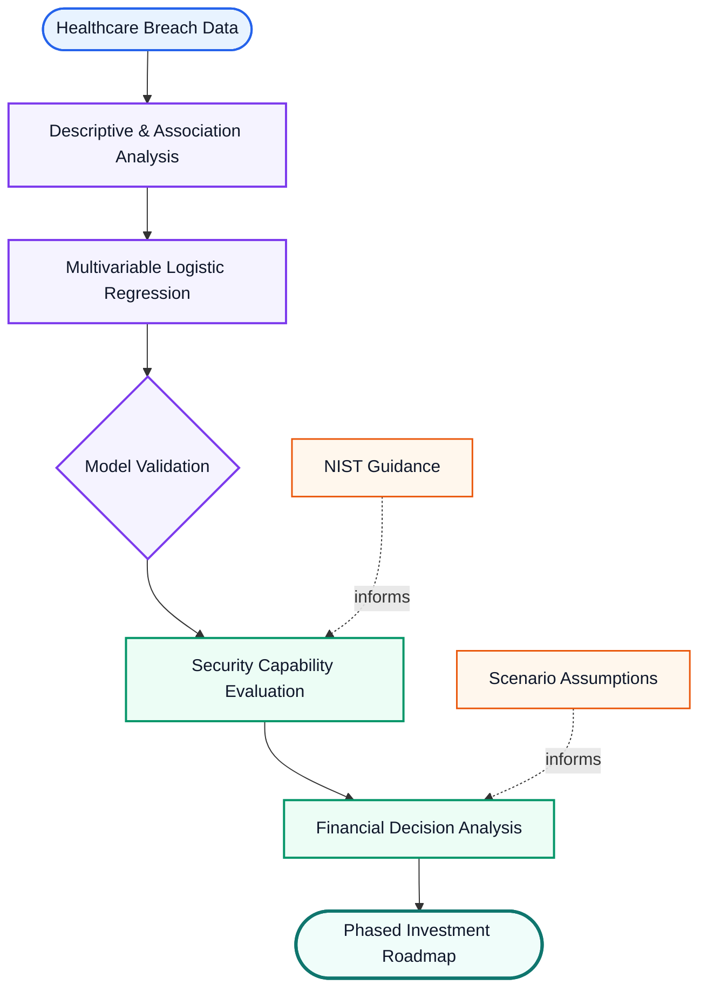

# Healthcare Security Architecture Investments

**Using Public Breach Evidence, NIST Guidance, and Financial Decision Analysis**

## Overview

Healthcare organizations must make security investment decisions while balancing breach risk, implementation priorities, and financial constraints. This research examines how public healthcare breach evidence can be analyzed and translated into a structured basis for security investment decisions.

The study connects statistical analysis of reported healthcare breaches with security capability evaluation and financial decision analysis. The purpose is not to predict whether a specific organization will experience a breach, but to use empirical evidence to support more transparent and defensible investment decisions.

## Research Question

> **“How can patterns and risk factors identified in reported healthcare breach data be used to inform security capability priorities and evaluate the financial conditions under which security investments are supportable?”**

### Research Objectives

1. **Analyze breach patterns** to examine the frequency and severity of reported healthcare breaches.
2. **Identify characteristics associated with severe breaches** using statistical analysis and multivariable logistic regression.
3. **Translate the empirical evidence into security capability considerations** using NIST guidance.
4. **Evaluate and compare security capability priorities** using defined decision criteria and alternative weighting assumptions.
5. **Assess financial feasibility** using investment cost, breach exposure, potential loss, risk reduction, NPV, payback, break-even, and sensitivity analysis.
6. **Develop a phased investment roadmap** that integrates the statistical, security, and financial analyses.

## Data Source

**U.S. Department of Health and Human Services, Office for Civil Rights (HHS OCR) Breach Portal**  
[HHS OCR Breach Portal](https://ocrportal.hhs.gov/ocr/breach/breach_report_hip.jsf)

## Research Approach

The research is organized as an evidence-to-decision process. Statistical analysis is first used to identify patterns and adjusted associations in reported breach data. The empirical evidence is then considered alongside NIST guidance to evaluate security capabilities. Financial analysis provides a separate assessment of the conditions under which candidate investments may be economically supportable.

## Methods

The quantitative analysis uses descriptive statistics, categorical association analysis, and multivariable logistic regression. Model performance and stability are evaluated using a stratified holdout sample and five-fold stratified cross-validation.

Security capabilities are evaluated using the statistical evidence, NIST guidance, and defined decision criteria. Alternative weighting approaches are used to examine whether priority rankings are sensitive to changes in the relative importance assigned to those criteria.

Financial decision analysis evaluates investment costs and expected avoided losses using annualized loss expectancy, net present value, payback, break-even analysis, and sensitivity analysis.

## Scope

The study examines associations in reported healthcare breach data rather than causal effects. The statistical model supports interpretation and risk stratification rather than organization-specific breach prediction. Financial analysis is scenario-based and evaluates decision conditions rather than assuming a universal return on security investment.

## Standards and Guidance

The security analysis is informed by **NIST Cybersecurity Framework 2.0**, **NIST SP 800-30**, and **NIST SP 800-207**.
