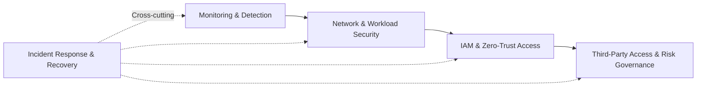

# Healthcare Security Architecture Investments

**Using Public Breach Evidence, NIST Guidance, and Financial Decision Analysis**

## Research Focus

Healthcare organizations make security investment decisions under uncertainty. This research examines how evidence from reported healthcare breaches can be used to identify characteristics associated with severe outcomes, translate those findings into security capability priorities, and evaluate the financial conditions under which security investments may be economically supportable.

## Research Questions

1. **What patterns are present in the frequency and severity of reported healthcare breaches?**
2. **What observable breach characteristics are associated with severe outcomes after adjustment for other characteristics?**
3. **How can the empirical findings be mapped to security capabilities using NIST guidance?**
4. **Which candidate security capabilities receive the strongest priority under the decision criteria, and how sensitive are those priorities to alternative weighting assumptions?**
5. **Under what cost, exposure, loss, and risk-reduction assumptions do candidate security investments become financially supportable?**
6. **How can the combined evidence inform a phased security investment roadmap?**

## Data Source

**U.S. Department of Health and Human Services, Office for Civil Rights (HHS OCR) Breach Portal**

## Research Approach

The research separates statistical evidence from security and financial decision-making. Observed associations are not interpreted as causal effects, and statistical results are not treated as direct recommendations to purchase a particular technology.

## Analytical Methods

The quantitative analysis uses descriptive statistics, categorical association testing, and multivariable logistic regression to examine severe reported breaches. Model performance and stability are evaluated using a stratified holdout sample and five-fold stratified cross-validation.

The security decision analysis connects empirical findings with NIST guidance and evaluates candidate capabilities using multiple decision criteria and alternative weighting approaches. Financial analysis then examines annualized loss expectancy, avoided loss, net present value, payback, break-even conditions, and sensitivity to key assumptions.

## Key Findings

Network-server involvement was associated with **3.49 times the adjusted odds** of a severe reported breach (95% CI: 2.84–4.30). Business Associate entity type was associated with **3.55 times the adjusted odds** relative to Healthcare Providers (95% CI: 2.70–4.66).

The logistic regression demonstrated moderate and stable discrimination, with a held-out **ROC-AUC of 0.776** and a five-fold cross-validation mean **ROC-AUC of 0.757 (SD = 0.012)**.

**Monitoring and Detection** ranked first under both equal-weight and risk-focused security capability evaluations.

None of the primary financial scenarios produced positive five-year NPV or finite payback. Sensitivity analysis showed that a **$100,000 initial investment with no annual operating cost required an 11.7% risk reduction to break even**.

## Evidence-to-Decision Logic

| Research Stage | Question Addressed |
|---|---|
| Descriptive and statistical analysis | What patterns and adjusted associations are present in the breach evidence? |
| Model validation | Are the statistical results reasonably stable? |
| Security capability evaluation | Which capabilities receive stronger priority based on the combined evidence and decision criteria? |
| Financial analysis | Under what assumptions does an investment become financially supportable? |
| Roadmap | How can the resulting priorities be sequenced? |

## Investment Roadmap

The roadmap represents a decision sequence rather than a universal implementation prescription. Investment scale and timing depend on organizational exposure, implementation cost, operating requirements, and realistically achievable risk reduction.

## Scope and Limitations

The research is based on reported healthcare breach events and does not estimate the annual probability that a particular healthcare organization will experience a breach. The observational design supports association rather than causal inference. Financial conclusions are scenario-dependent and should be interpreted within the assumptions used in the analysis.

## Standards and Guidance

The security decision analysis is informed by **NIST Cybersecurity Framework 2.0**, **NIST SP 800-30**, and **NIST SP 800-207**.
