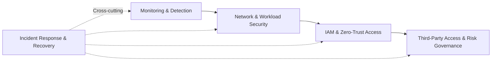

# Healthcare Security Architecture Investments

**Using Public Breach Evidence, NIST Guidance, and Financial Decision Analysis**

## Overview

Healthcare organizations face security investment decisions under substantial uncertainty. Public breach records can reveal patterns in reported incidents, but those patterns do not automatically determine which security capabilities should be prioritized or whether an investment will be financially justified.

This applied business analytics project develops an evidence-to-decision approach using U.S. Department of Health and Human Services Office for Civil Rights (HHS OCR) breach data. The analysis combines descriptive statistics, interpretable logistic regression, model validation, security capability evaluation, and financial decision analysis to examine three questions:

1. **What characteristics are associated with severe reported healthcare breaches?**
2. **How can those findings inform security capability priorities?**
3. **Under what financial conditions do security investments become economically supportable?**

---

## Analytical Approach

The project separates empirical analysis from security and financial decision-making. Statistical associations are not treated as causal effects, and the regression does not directly prescribe a technology investment. Instead, the empirical results provide one source of evidence for evaluating security capabilities, while financial analysis separately examines implementation feasibility.

---

## Data

The empirical analysis uses healthcare breach records reported through HHS OCR.

| Measure | Result |
|---|---:|
| Source records | 7,884 |
| Model-ready observations | 7,877 |
| Severe breaches | 801 |
| Severe-breach rate | 10.2% |
| Severe-breach definition | ≥100,000 individuals affected |
| Median individuals affected | 4,000 |
| Mean individuals affected | ~136,399 |

The distribution of breach size is strongly right-skewed, reflecting a relatively small number of exceptionally large events.

---

## Methods

The analytical workflow includes descriptive analysis, categorical association testing, multivariable logistic regression, and model validation. Logistic regression estimates adjusted associations between observable breach characteristics and the probability that a reported breach affected at least 100,000 individuals.

Predictors include breach type, information-location indicators, covered-entity type, and business-associate involvement. Model performance is evaluated with a stratified 80/20 training-test split and five-fold stratified cross-validation within the training sample.

Security capabilities are evaluated separately using empirical relevance, supporting evidence, NIST alignment, implementation cost, feasibility, operational impact, dependencies, and time to value. Equal-weight and risk-focused scoring approaches are compared to assess the stability of the resulting priorities.

Financial analysis evaluates annualized loss expectancy, avoided loss, implementation and operating costs, five-year net present value, payback, break-even risk reduction, and sensitivity to key assumptions.

---

## Key Findings

Network-server involvement was associated with **3.49 times the adjusted odds** of a severe reported breach (95% CI: 2.84–4.30). Business Associate entity type was associated with **3.55 times the adjusted odds** relative to Healthcare Providers (95% CI: 2.70–4.66).

The logistic model demonstrated moderate and stable discrimination. Held-out **ROC-AUC was 0.776**, while five-fold cross-validation produced a mean **ROC-AUC of 0.757 (SD = 0.012)**.

**Monitoring and Detection** ranked first under both equal-weight and risk-focused security capability evaluations. Under risk-focused weighting, Network and Workload Security ranked second, followed by IAM/Zero-Trust Access and Third-Party Access and Risk Governance.

None of the primary financial scenarios produced positive five-year NPV or finite payback. Sensitivity analysis showed that the economics changed substantially as investment cost and exposure assumptions changed. In a lower-cost case with a **$100,000 initial investment and no annual operating cost, the required risk reduction to break even was 11.7%**.

---

## Interpretation

The statistical model is best understood as an interpretable risk-stratification model for patterns among reported healthcare breaches rather than an organization-specific breach predictor. The findings identify associations, not causal effects or proof that a particular security control will prevent severe breaches.

The security capability evaluation translates empirical evidence into a broader decision context rather than treating an odds ratio as a direct technology recommendation. The stability of Monitoring and Detection across both weighting approaches provides additional support for its position as the first capability priority.

The financial findings similarly do not imply that security investment lacks value. Instead, they demonstrate that financial feasibility depends on the relationship between implementation cost, organizational exposure, potential loss, and realistically achievable risk reduction.

---

## Investment Roadmap

The roadmap represents a practical decision sequence rather than a universal prescription. Investment scale and timing should be adapted to an organization's exposure, costs, operational requirements, and expected risk reduction.

---

## Decision Perspective

The project connects three levels of analysis:

| Evidence | Decision Question |
|---|---|
| Breach patterns and adjusted associations | **What appears most relevant to severe outcomes?** |
| Security capability evaluation | **What deserves priority?** |
| Financial and break-even analysis | **Under what conditions does the investment make sense?** |

Together, these components provide a transparent path from public breach evidence to interpretable findings, security priorities, and financially informed investment decisions.

---

## Scope and Limitations

HHS OCR data describe reported healthcare breaches and do not provide an organization-year denominator. The analysis therefore cannot estimate the annual probability that a particular healthcare organization will experience a breach. The severe-breach threshold of 100,000 affected individuals is study-defined, and the observational design does not support causal claims about breach characteristics or control effectiveness.

Financial results depend on scenario assumptions because the public data do not contain complete organization-specific investment costs, financial losses, or control-effectiveness estimates. Security capability rankings likewise depend on the selected criteria, scores, and weighting assumptions.

---

## Standards and Guidance

The decision analysis is informed by **NIST Cybersecurity Framework (CSF) 2.0**, **NIST SP 800-30 — Guide for Conducting Risk Assessments**, **NIST SP 800-207 — Zero Trust Architecture**, and HHS OCR healthcare breach reporting data.
