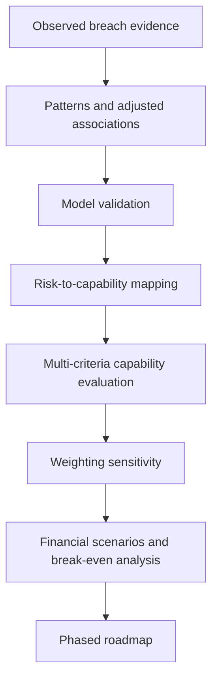

# Evidence-to-Decision Approach

The project separates empirical evidence, security decision analysis, and financial analysis so that each component answers a different question.

## 1. What does the data tell us?

Descriptive statistics, association measures, and logistic regression identify characteristics associated with severe outcomes among reported breaches. Holdout testing and cross-validation assess whether discrimination is reasonably stable.

## 2. What deserves priority?

Statistical findings are combined with recognized security guidance and implementation considerations. Network-server severity informs consideration of Network and Workload Security and Monitoring and Detection. Business-associate exposure informs Third-Party Access and Risk Governance. Identity and access concerns inform IAM and Zero-Trust Access. Incident Response and Recovery is treated as a cross-cutting resilience capability.

Monitoring and Detection remains the highest-ranked capability under both evaluated weighting approaches.

## 3. Under what conditions does the investment make financial sense?

Financial evaluation is performed separately from the regression. Negative primary NPVs do not imply that security investment lacks value. Instead, break-even and sensitivity analyses identify how implementation cost, recurring cost, organizational exposure, potential loss, and achievable risk reduction change the business case.

## Roadmap

1. Monitoring and Detection
2. Network and Workload Security
3. IAM and Zero-Trust Access
4. Third-Party Access and Risk Governance

Incident Response and Recovery operates across the sequence rather than only as a final phase.

The roadmap is a decision sequence, not a universal implementation prescription.
